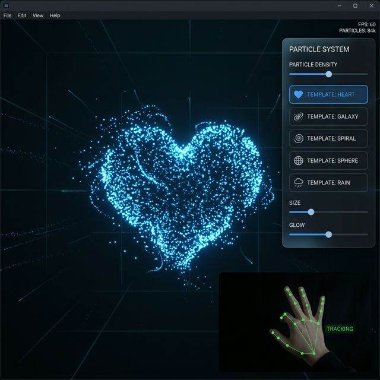

# 🌌 AI Hand-Tracked 3D Particle System

An interactive real-time 3D particle visualizer powered by **Three.js** and **MediaPipe Hand Tracking**. Control stunning particle formations with your hands through your webcam!



---

## ✨ Features

- **Real-Time Hand Tracking** — Uses MediaPipe to detect hand gestures via your webcam
- **Hand Repulsion Physics** — Particles dynamically push away from your hand position in 3D space
- **Pinch Gesture Color Change** — Pinch your thumb and index finger to randomize particle colors
- **5 Unique Particle Templates:**
  - 💖 Sacred Heart
  - 🌸 Blooming Flower
  - 🪐 Rings of Saturn
  - 🧘 Buddha Aura
  - 🎆 Radial Burst
- **Custom Color Picker** — Choose any particle color via the UI
- **Smooth Transitions** — TWEEN.js powered morphing between particle shapes
- **Orbit Controls** — Click and drag to rotate, scroll to zoom the 3D scene
- **Glassmorphism UI** — Modern, dark-themed floating control panel

---

## 🚀 Getting Started

### Prerequisites

- A modern web browser (Chrome, Edge, Firefox)
- A webcam (for hand tracking features)

### Run Locally

1. **Clone the repository:**
   ```bash
   git clone https://github.com/RAZAULLAH-KHAN/MediaPipe-Hand-Tracking.git
   cd MediaPipe-Hand-Tracking
   ```

2. **Open the app:**

   Simply open `index.html` in your browser, or use a local server:
   ```bash
   # Using Python
   python -m http.server 8000

   # Using Node.js
   npx serve .
   ```

3. **Allow webcam access** when prompted.

---

## 🎮 How to Use

| Action | Effect |
|---|---|
| 🖐 Move your hand | Particles repel away from your hand |
| 🤏 Pinch (thumb + index) | Randomly changes particle color |
| 🖱 Click + Drag | Rotate the 3D scene |
| 🔄 Scroll wheel | Zoom in / out |
| 🎨 Color picker (UI) | Set a custom particle color |
| 📐 Template buttons (UI) | Switch between particle formations |

---

## 🛠 Tech Stack

| Technology | Purpose |
|---|---|
| [Three.js](https://threejs.org/) | 3D rendering & WebGL |
| [MediaPipe Hands](https://google.github.io/mediapipe/solutions/hands.html) | Real-time hand tracking |
| [TWEEN.js](https://github.com/tweenjs/tween.js/) | Smooth shape transitions |
| GLSL Shaders | Custom particle rendering |
| Vanilla HTML/CSS/JS | Single-file application |

---

## 📁 Project Structure

```
├── index.html    # Complete application (HTML + CSS + JS)
├── preview.png   # Project preview image
└── README.md     # This file
```

---

## 🧠 How It Works

1. **Three.js** creates a 3D scene with 15,000 particles using custom GLSL shaders
2. **MediaPipe** processes webcam frames to detect hand landmarks in real-time
3. Hand position is mapped from 2D webcam coordinates to 3D scene coordinates
4. A **repulsion force** pushes particles away from the tracked hand position
5. **Finger tension** (spread of fingers) controls the global particle scale
6. **Pinch detection** measures thumb-index distance to trigger color changes

---

## 📄 License

This project is open source and available under the [MIT License](LICENSE).

---

## 👤 Author

**Raza Ullah Khan**
- GitHub: [@RAZAULLAH-KHAN](https://github.com/RAZAULLAH-KHAN)

---

> ⭐ If you found this project interesting, consider giving it a star!
